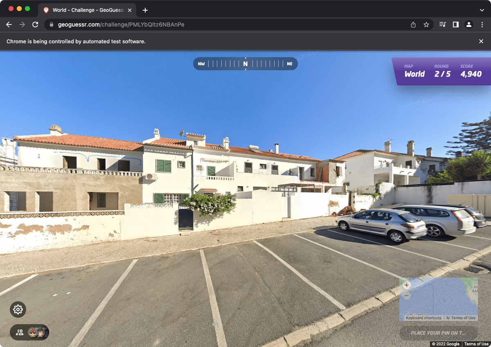
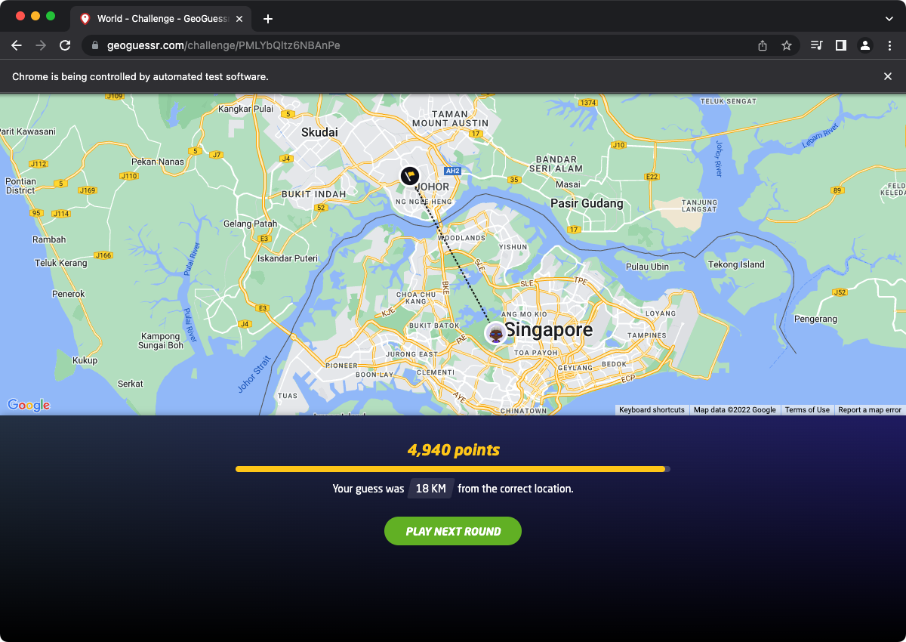
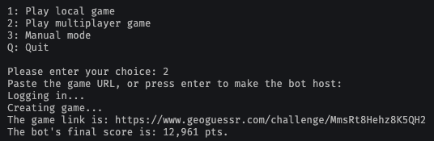

# Geoguessr Bot

### Main features:

- Neural network trained on over 50,000 Google Streetview images
- Better performing than the average human with 50% accuracy for guessing correct country, and gets over 2000 pts in geoguessr with 75% accuracy
- The bot can automatically start a local game (Free) or a multiplayer game (Requires a geoguessr Pro account)
- Option to manually feed an image, and returns the corresponding country and coordinates

 

**Automatically analyses the Streetview image and makes a guess** 

**Performs better than the average human** 

**An intuitive scripts automatically runs the bot** 
